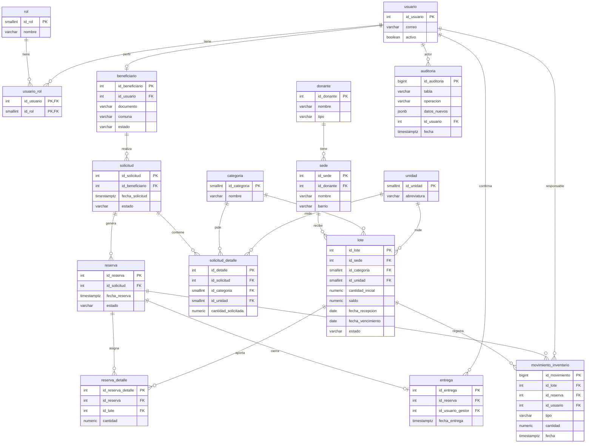

Diagrama de la base de datos `alimenta`.

```mermaid
erDiagram
  rol ||--o{ usuario_rol : tiene
  usuario ||--o{ usuario_rol : tiene
  usuario ||--o| beneficiario : perfil
  donante ||--o{ sede : tiene
  sede ||--o{ lote : recibe
  categoria ||--o{ lote : clasifica
  unidad ||--o{ lote : mide
  beneficiario ||--o{ solicitud : realiza
  solicitud ||--o{ solicitud_detalle : contiene
  categoria ||--o{ solicitud_detalle : pide
  unidad ||--o{ solicitud_detalle : mide
  solicitud ||--o{ reserva : genera
  reserva ||--o{ reserva_detalle : asigna
  lote ||--o{ reserva_detalle : aporta
  reserva ||--o| entrega : cierra
  usuario ||--o{ entrega : confirma
  lote ||--o{ movimiento_inventario : registra
  reserva ||--o{ movimiento_inventario : origina
  usuario ||--o{ movimiento_inventario : responsable
  usuario ||--o{ auditoria : actor

  rol {
    smallint id_rol PK
    varchar nombre
  }
  usuario {
    int id_usuario PK
    varchar correo
    boolean activo
  }
  usuario_rol {
    int id_usuario PK, FK
    smallint id_rol PK, FK
  }
  donante {
    int id_donante PK
    varchar nombre
    varchar tipo
  }
  sede {
    int id_sede PK
    int id_donante FK
    varchar nombre
    varchar barrio
  }
  categoria {
    smallint id_categoria PK
    varchar nombre
  }
  unidad {
    smallint id_unidad PK
    varchar abreviatura
  }
  beneficiario {
    int id_beneficiario PK
    int id_usuario FK
    varchar documento
    varchar comuna
    varchar estado
  }
  lote {
    int id_lote PK
    int id_sede FK
    smallint id_categoria FK
    smallint id_unidad FK
    numeric cantidad_inicial
    numeric saldo
    date fecha_recepcion
    date fecha_vencimiento
    varchar estado
  }
  solicitud {
    int id_solicitud PK
    int id_beneficiario FK
    timestamptz fecha_solicitud
    varchar estado
  }
  solicitud_detalle {
    int id_detalle PK
    int id_solicitud FK
    smallint id_categoria FK
    smallint id_unidad FK
    numeric cantidad_solicitada
  }
  reserva {
    int id_reserva PK
    int id_solicitud FK
    timestamptz fecha_reserva
    varchar estado
  }
  reserva_detalle {
    int id_reserva_detalle PK
    int id_reserva FK
    int id_lote FK
    numeric cantidad
  }
  entrega {
    int id_entrega PK
    int id_reserva FK
    int id_usuario_gestor FK
    timestamptz fecha_entrega
  }
  movimiento_inventario {
    bigint id_movimiento PK
    int id_lote FK
    int id_reserva FK
    int id_usuario FK
    varchar tipo
    numeric cantidad
    timestamptz fecha
  }
  auditoria {
    bigint id_auditoria PK
    varchar tabla
    varchar operacion
    jsonb datos_nuevos
    int id_usuario FK
    timestamptz fecha
  }
```